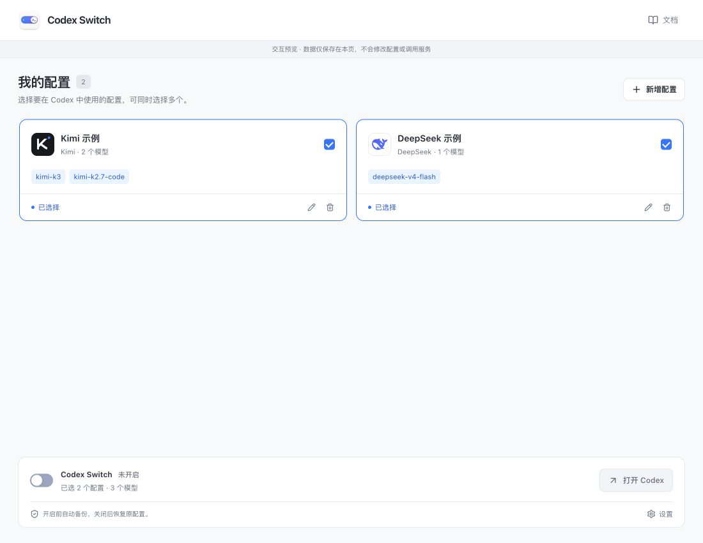

# Codex Switch

[简体中文](README.md) · **English**

Connect Codex App to the models you choose. **One configuration, one API key, multiple models.** Enable several configurations together, back up before enabling, and restore your original settings when disabling.

Built for macOS / Windows with Tauri 2, React and Rust, with an Astro + Starlight documentation site. Currently a **0.1.0 developer preview**: public signed installers are not available, and real Codex App end-to-end validation is not complete.

[Quickstart](apps/website/src/content/docs/en/docs/quickstart.md) · [Model settings](apps/website/src/content/docs/en/docs/configuration.md) · [Installation](apps/website/src/content/docs/en/docs/install.md)



_The screenshot shows the Chinese app in browser preview with example configurations. Native connection, backup and process states are simulated. [Screenshot notes (Chinese)](docs/design/screenshots.md)_

## Features

- **Multiple providers:** built-in presets for Zhipu GLM, DeepSeek, Kimi, Qwen and MiniMax, plus GLM Coding Plan, MiniMax Token Plan, Kimi Coding and Qwen Token Plan. Custom HTTPS APIs are also supported.
- **Per-model settings:** select 1–20 models per configuration, choose a default, and override URLs, API formats, context windows, reasoning levels, image input and parallel tool capabilities.
- **Two API formats:** native Responses forwarding and local Chat Completions conversion. Failures do not automatically switch providers or protocols.
- **Recoverable configuration changes:** preserve the original `config.toml` before enabling and restore its exact contents when disabling. Detect external edits without changing `auth.json` or session files.
- **Local operation:** keys stay in the system credential store and requests go from your device to the selected service. Includes a system tray, background operation and optional start at login.
- **Chinese and English:** switch languages to the left of **Docs**. Pages, dialogs and tray menus update together, and the choice persists after reopening.

## Connect in three steps

1. **Add a configuration:** choose a provider and plan, then enter a name, API URL and matching key.
2. **Select models and save:** choose your models and adjust capabilities if needed. Saving sends no requests; **Test configuration** is a separate, manually triggered connectivity check.
3. **Select configurations and enable:** select at least one configuration on the home screen, turn on the main switch, then open Codex App from your operating system. Models appear as `configuration-name-model`.

The interface is locked while enabled. Disable the service before changing configurations, selections or settings. Closing the window keeps connections running in the background. If Codex is already running, finish your task before quitting and reopening it to load the configuration. See the [screenshot walkthrough](apps/website/src/content/docs/en/docs/quickstart.md) and [enable and disable](apps/website/src/content/docs/en/docs/switch.md) guide.

## Update the app

When a newer version is available, a blue download icon and version number appear in the header. Click to download the installer for your system and architecture directly through your default browser, without visiting the release page. Disable the service and quit Codex and Codex Switch normally before installing. Installation and restarting remain manual.

## Configuration essentials

| Setting                   | Purpose                                                                                                                                                                                   |
| ------------------------- | ----------------------------------------------------------------------------------------------------------------------------------------------------------------------------------------- |
| API URL                   | Usually a base URL. The app appends `/responses` or `/chat/completions` while preserving existing path prefixes.                                                                          |
| Full URL                  | Sends ordinary requests to the entered URL without appending a path. Use it for a complete request endpoint.                                                                              |
| API format                | Choose Responses or Chat Completions to match the service. Failures do not automatically change formats.                                                                                  |
| API key                   | Shared by all models in the configuration. Leave blank when editing to keep it; re-enter it after changing a request URL or full-URL mode.                                                |
| Model settings            | Models inherit the configuration’s URL and format unless overridden through **Edit**. Confirm the dialog, then save the whole configuration.                                              |
| Remote context compaction | Off by default; keeping it off is recommended. Ordinary model requests can still produce summaries. The preference saves automatically and applies the next time Codex Switch is enabled. |

Details: [Model settings](apps/website/src/content/docs/en/docs/configuration.md) · [Connect providers](apps/website/src/content/docs/en/docs/providers.md) · [General settings](apps/website/src/content/docs/en/docs/settings.md). Declaring capabilities does not verify that the service supports them; remote compaction requires upstream support in particular.

## Open-source credits: CC Switch

This project references and directly reuses parts of the open-source code and tests from [CC Switch](https://github.com/farion1231/cc-switch). Thank you to its author and contributors. Reused components include **Chat / Responses conversion, SSE handling, tool history and schema helpers, model catalogs and capability templates**.

- Pinned upstream commit: [`06082e189d65e6d6dbadc35dacdac1ce6c79d89a`](https://github.com/farion1231/cc-switch/tree/06082e189d65e6d6dbadc35dacdac1ce6c79d89a).
- Sources live in [`crates/cc-switch-codex`](crates/cc-switch-codex), preserving the [upstream MIT license](crates/cc-switch-codex/LICENSE) and copyright notices.
- See [UPSTREAM.md](crates/cc-switch-codex/UPSTREAM.md) for reuse boundaries, local differences and update procedures. A manifest verifies files and extracted snippets.

Codex Switch maintains its own interface, configuration backup and recovery, credential management, HTTP routing lifecycle and documentation. The reused module is extracted source code, not an official CC Switch SDK. This is an independent community project, unaffiliated with OpenAI.

## Local development

Requires Node.js 22.12+, pnpm 10 and stable Rust. Native builds also require Xcode Command Line Tools on macOS, or Microsoft C++ Build Tools / WebView2 on Windows.

```sh
git clone https://github.com/goo-yyh/codex-switch.git
cd codex-switch
pnpm install --frozen-lockfile
pnpm dev       # Desktop UI browser preview: http://127.0.0.1:1420
pnpm website   # Documentation site: http://127.0.0.1:4321
```

Run the two development servers in separate terminals. The browser preview uses simulated page data: it does not read keys, call models or change Codex configuration. `pnpm desktop` starts the real native app and accesses local configuration and the system credential store.

```sh
pnpm check
pnpm test
pnpm check:upstream
cargo clippy -p codex-switch-core --all-targets --no-deps -- -D warnings
pnpm build
pnpm check:links
pnpm check:secrets
```

`pnpm build` builds the interface and documentation site. Native packages are written to `target/release/bundle/`:

```sh
# macOS
pnpm --filter @codex-switch/desktop tauri build
# Windows
pnpm --filter @codex-switch/desktop tauri build --config src-tauri/tauri.windows.conf.json
```

Set `PUBLIC_SITE_URL` for the documentation site’s deployment URL and `VITE_PUBLIC_DOCS_URL` for the app’s documentation link.

## Validation and limitations

Offline tests use temporary configuration directories, mock credentials and local synthetic HTTP services. They do not operate the real Codex app. Real provider tests require an explicit run after configuring a local `.env` using `.env.example`; they may incur API charges:

```sh
pnpm test:providers deepseek # Text, streaming, simulated tools and tool results
# Minimal summary check: one ordinary request per provider's default model; no Codex launch
cargo run -p codex-switch-core --bin provider-compact-check -- --summary-smoke --all
```

The [summary smoke test on September 17, 2026 (Chinese)](docs/testing/provider-summary-smoke-2026-09-17.md) recorded completed responses and nonempty summaries from all five preset default models. This only establishes successful summary generation in that run—not factual completeness, conversation continuation, remote compaction or end-to-end Codex App compatibility.

Public signing, notarization and testing on a real Windows device remain incomplete. CI artifacts are not official releases. Codex tools may share a configuration directory; CLI / IDE extension compatibility is not currently guaranteed.

## Repository and license

See the [architecture guide (Chinese)](docs/development/architecture.md) for module responsibilities, call flows and maintenance constraints.

| Directory                | Contents                                                                         |
| ------------------------ | -------------------------------------------------------------------------------- |
| `apps/desktop`           | React interface and Tauri native shell                                           |
| `crates/core`            | Configuration recovery transactions, gateway, compatibility adapters and storage |
| `crates/cc-switch-codex` | Pinned CC Switch modules, tests and license                                      |
| `apps/website`           | User guides and interface screenshots                                            |
| `packages`               | Shared design tokens, provider and model presets                                 |
| `docs`                   | Technical plans, source research and test records                                |

[Technical plan (Chinese)](docs/product-plan.md) · [Provider test plan (Chinese)](docs/testing/provider-test-plan.md) · [Open-source credits](apps/website/src/content/docs/en/docs/open-source.md)

This project uses the [MIT License](LICENSE). Third-party code retains its own copyright and license notices.

## Bilingual documentation and SEO

The site defaults to Chinese, with English under `/en/`. The home page opens directly to the documentation, and language switching preserves the equivalent page. Set `PUBLIC_SITE_URL` to the production HTTPS origin for canonical URLs, reciprocal hreflang links, sharing cards and sitemaps. Set `PUBLIC_SITE_INDEXABLE=false` for previews. Local builds without a domain default to no indexing.

After building, run `pnpm check:links` and `pnpm check:seo`. Use `pnpm check:seo -- --require-site` to validate a production domain configuration.

## Deploy to Vercel

Import the repository with Root Directory set to `.` and Framework Preset set to **Other**. The root `vercel.json` configures `pnpm build:website` and `apps/website/dist`. It builds only the documentation site, not the desktop app.

Set `PUBLIC_SITE_URL` to the production origin. If omitted, the stable production domain provided by Vercel system variables can be used. Preview deployments disable indexing automatically. Chinese paths and `/en/` paths return HTTP 404 pages in the corresponding language.

Run `pnpm build:website && pnpm check:deployment` to check deployment routing locally. Use `pnpm preview:website` to preview static error-page behavior.
