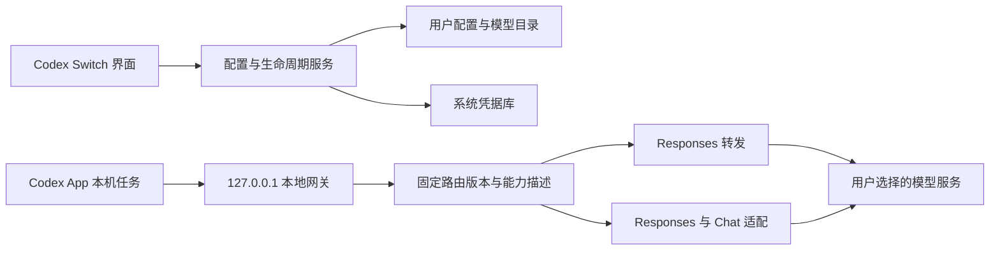

> **实现更新（2026-09-16）**：产品已按用户确认改为「具名配置 → 一个 Key → 多个模型」。关闭后维护配置；开启期间至少选中一个配置，勾选立即应用，新旧会话统一使用当前配置。当前行为以 [界面规范](design/ui-spec.md) 和 [当前配置规则](reviews/2026-09-16-current-config.md) 为准；下文保留早期方案的调研背景。

# Codex Switch：完整产品与技术方案

日期：2026-09-15 · 状态：研发建议稿 · 依据：[源码研究](research/cc-switch.md) · 界面：[交互规范](design/ui-spec.md)

> 当前执行约束（用户后续明确）：允许隔离单元测试和真实供应商测试；真实服务 Key 必须从本地 `.env` 读取，不上传 GitHub。两类测试分开运行，单元测试不加载真实凭据。不使用真实 Codex App 测试，不启动或重启 App，不读写用户真实配置、登录、会话或系统凭据。下文 App 实机验收均为延期事项，须用户明确恢复后再安排。具体见[单元测试方案](testing/unit-test-plan.md)和[真实服务测试方案](testing/provider-test-plan.md)。

## 一、产品决策

**定位：让 Codex App 接入你选择的模型服务。**

交付物：一个桌面 App、一套独立官网与产品文档。全部位于本仓库，产品和站点共享品牌、供应商说明和发布信息。

核心路径：**选择服务 → 填入 API Key → 配置并打开 Codex**。连接验证、网关启动、配置备份、协议选择都在这条路径中自动完成，不让用户分别找开关。

### 范围

首版必须包含：

- Codex App 的本机模型请求接入。
- 国内供应商预设和自定义中转站，支持多份配置及默认服务切换。
- 原生 Responses 转发和 Chat Completions 适配。
- 模型目录、基础工具调用、多轮对话、流式输出和取消的兼容。
- 最小连接验证、错误修正、配置备份/恢复、保留既有登录。
- 一键打开 Codex App；必要时引导正常重启。
- 托盘后台运行、恢复原有连接、真实安装包和独立文档。

不属于本产品范围：CLI/IDE 的操作入口、其他 Agent 工具、MCP/Skills 管理、会话管理器、账号池、订阅额度聚合、充值售卖、云端任务路由。ChatGPT Chat/Work 等其他执行引擎不属于接管范围。

“只支持 App”是产品和验收范围，**不等于用户级配置天然只影响 App**。如果用户另用同一个 Codex home 运行 CLI/IDE，配置可能共享；在设置与恢复文档中明确说明。首版不靠复制整个 home 或改写会话数据库强行隔离。

### 平台与发行建议

- 先完成 macOS Apple Silicon 的技术验证和首个可用预览版。
- 正式 v1.0 同时验收 macOS 与 Windows；Windows 在完成真实安装、启动与配置验证前不展示可用下载。
- Linux 列为后续平台，依据届时目标 App 发行形态单独验证，不因为 Tauri 可打包就宣称支持。
- 不承诺“一次配置后任何版本永远可用”：维护明确的 Codex App 兼容版本范围。

上述为执行顺序建议，并非额外扩大客户端范围。

## 二、用户体验

### 2.1 首次打开

后台只读检测 Codex App 安装位置、版本、运行状态、配置位置和已有配置冲突。应用未安装也允许先保存服务，主按钮改为“下载 Codex”；安装后返回即可继续。

首页直接呈现“连接你的 Codex”，下面是一张配置表单，不设置欢迎轮播或多步向导。

| 字段 | 国内供应商 | 自定义中转站 |
| --- | --- | --- |
| 服务 | 选择预设 | 选择“自定义中转站” |
| 套餐/区域 | 仅存在不同认证或计费端点时显示，并要求明确选择 | 默认不显示 |
| API 地址 | 预设填写，默认收起 | 必填；支持粘贴基础地址或完整端点 |
| API Key | 必填；密码输入框 | 必填；密码输入框 |
| 模型 | 自动填入已验证默认项，可搜索/更改 | 自动获取或直接输入 ID |
| 高级选项 | 默认收起 | 默认收起 |

国内单端点预设的最短路径只需“选择服务＋粘贴密钥＋点击主按钮”。如果套餐或模型权限无法自动确定，显示必要选择，不能为了减少点击而猜测用户购买的服务。

主按钮：**配置并打开 Codex**。下方一行：“将发送少量测试请求，可能产生少量 API 费用。”点击行为本身明确授权这一小范围测试；不触发真实项目任务。

### 2.2 点击主按钮后

1. 校验输入，确认地址、密钥和模型匹配。
2. 对所选地址执行有预算限制的最小探测；预设无需每次探测所有协议。
3. 启动/检查本地路由服务；失败时不改 Codex 配置。
4. 校验目标配置兼容性和写入前快照，生成模型目录及恢复记录。
5. 原子应用本项目拥有的字段；读回确认。
6. Codex 未运行：启动应用；已经运行且不需要重新加载：激活窗口。
7. 已运行且本次配置需要重载：显示“重启 Codex 以应用配置”，用户也可选择“稍后”。

等待期间按钮展示“验证连接…”或“准备 Codex…”，保留可取消能力；不要求用户先“保存”，再“开启代理”，再“启用路由”。

成功文案区分三个事实：

- “连接验证通过”：合成测试通过。
- “配置已保存，等待 Codex 重启”：尚未生效。
- “已打开 Codex”：系统启动成功；不代表已证明一个真实编码任务成功。

### 2.3 日常首页

一个紧凑主视图：

- 顶部：产品名，右侧“帮助”“设置”。
- 中部：新任务默认服务、模型、简短状态。
- 主按钮：**打开 Codex**；待生效时变为“重启并应用”。
- 下部：已保存的连接列表，行式展示；提供“添加连接”和行内“设为默认”。
- 原有连接单独作为恢复入口，不从用户登录信息中构造一个可导出的供应商。

不展示流量图、费用排行、大面积状态卡、促销卡片或多应用侧栏。用户主要决定“用哪一家”，模型及编辑入口跟随该服务。

### 2.4 切换与任务连续性

默认服务切换的产品语义：**用于新任务，现有任务继续使用原连接**。

- 首版不提供“强制把运行中任务切换到另一家”的功能。
- 同一 HTTP/SSE 请求一旦选定 route revision，就一直使用它；修改默认值不得改变正在传输的请求。
- 工具循环后续请求由稳定模型别名和 response 会话绑定确定路由，不每次读取“当前选中服务”。
- 已创建的 Codex 任务可能保留模型和 provider 设置；不能只改 config.toml 后宣称旧任务全部切换。
- 模型目录和默认模型更新，首版按需要正常重启处理；经指定版本实机验证后才减少重启。
- 被旧任务引用的服务应先“停用新任务”，保留配置；永久删除时明确旧任务后续无法继续用该服务，不静默路由到其他服务。

### 2.5 一键打开与重启

macOS：使用 LaunchServices/NSWorkspace 按应用 bundle ID 查找并激活，不固定 `/Applications/Codex.app`。本机已观察到 `ChatGPT.app` 仍使用 `com.openai.codex`。CLI 命令 `open -b com.openai.codex` 仅作为实现语义参考，产品通过受限原生调用实现。

Windows：识别经过验证的包标识/AUMID 或受信任的可执行文件位置，通过系统激活接口启动；支持用户手动定位官方应用。发布前确认具体标识，不从名称相似就启动任意程序。

| 检测结果 | 行为 |
| --- | --- |
| 已安装且未运行 | 配置就绪后打开 |
| 运行中且配置已生效 | 激活已有窗口 |
| 运行中且配置待加载 | 一次“重启并应用”确认，允许稍后 |
| 无法确认任务是否运行 | 按可能有任务处理，绝不自动结束进程 |
| 正常退出被拒绝/超时 | 保持网关和原连接可用，提示用户稍后重试 |
| 未安装 | 官方下载入口、重新检测 |
| 多个安装副本 | 首次选择一次，记住标识和路径；失效后重新检测 |

不使用强制终止，不依赖未公开的远程控制接口；不把后台 app-server 内部重载方法当成其他应用可稳定调用的 API。

## 三、技术架构

### 3.1 技术栈

| 层 | 建议 | 原因 |
| --- | --- | --- |
| 桌面壳 | Tauri 2 | 原生启动、系统托盘、凭据访问、轻量桌面打包 |
| 界面 | React + TypeScript + Vite | 表单与状态表达清晰，开发工具成熟 |
| 交互组件 | Radix 基础组件 + 自定义样式 | 复用键盘/焦点行为，重新设计视觉，不沿用 CC Switch UI |
| 样式 | CSS variables + 少量 utility | App/官网共享品牌 token，避免整个组件库耦合 |
| 后端 | Rust + Tokio + Axum + reqwest | 异步流式请求、取消、背压、原生能力 |
| 配置 | toml_edit + serde | 保留用户注释、精准合并、结构校验 |
| 本地数据 | SQLite（Rust 访问） | 配置、版本、事务恢复记录；小规模无需额外服务 |
| 密钥 | macOS Keychain / Windows Credential Manager | 真正的上游 Key 不写到前端持久存储或普通配置 |
| 官网/文档 | Astro + Starlight，静态构建 | 首页可自由设计，产品文档有导航、搜索、目录 |
| 测试 | Rust 单元/集成 + 前端组件 + 平台实机验收 | 分层验证，不把构建通过当产品可用 |

采用 major 版本路线，实际初始化时固定经过验证的依赖版本与锁文件。Tauri [系统托盘](https://v2.tauri.app/learn/system-tray/)、[单实例](https://v2.tauri.app/plugin/single-instance/)、[更新器](https://v2.tauri.app/plugin/updater/) 作为桌面能力参考。

### 3.2 请求结构



所有第三方连接统一经过本地网关，原生 Responses 尽量透传；Chat 才做必要转换。这样 UI 不必展示两套工作模式，密钥也统一留在本机后端。代价是使用期间需要后台进程，因此“关闭窗口继续运行”和“恢复原连接”必须完整实现。

首版不做代理链、全局系统代理、透明网络截获，也不接管 ChatGPT 账户相关域名。恢复原有连接后，Codex 重新使用原配置；该路径不要求网关继续运行。

### 3.3 模块边界

```text
Desktop IPC commands
  ├─ AppDetector / AppLauncher
  ├─ ConnectionService / ProviderRegistry
  ├─ ProbeService
  ├─ ConfigTransaction / RecoveryService
  ├─ CatalogBuilder / CompatibilityProfile
  └─ GatewayRuntime
       ├─ RequestAuthenticator
       ├─ RouteResolver
       ├─ ResponsesPassthrough
       ├─ ResponsesChatAdapter
       └─ SessionBridge / Cancellation / Diagnostics
```

前端调用固定命令，不获得任意文件写入、任意命令执行或通用 HTTP 代理权限。Tauri 命令返回脱敏数据，保存 API Key 后只返回“已保存”状态。

### 3.4 本地网关契约

- 仅绑定 `127.0.0.1`，初次选择可用端口后持久化；每次启动优先绑定原端口。端口占用时检测身份，不能把 Key 发给占位服务，也不能悄悄换端口却保留旧配置。
- 独立随机本地 bearer token，只给本应用网关认证；不使用固定 `sk-placeholder` 作为有效认证。
- 数据面最低端点：`GET /healthz`、`GET /v1/models`、`POST /v1/responses`、`POST /v1/responses/compact`。健康响应不泄露连接详情；模型与请求端点需要认证；管理操作仅走 Tauri IPC。
- URL 规范化使用 URL parser。完整 `/responses` 或 `/chat/completions` 可以识别并拆分；保留自定义前缀，不能自动给所有服务追加 `/v1`。
- 发往上游时移除本地 token、Cookie 和客户端账户认证元数据；由选中服务重新注入 Key。限制重定向，不把认证自动转发到新 origin。
- SSE 按字节流解析，支持 UTF-8 跨块、参数跨块、多个工具调用、usage、正常结束和中途错误；客户端断开要取消上游和释放资源。
- 超时分为建连、首字节、流空闲；明确背压、请求体上限和并发上限。
- 默认不跨供应商自动重试；仅在明确未开始输出、且可安全重试的条件下，对同一路由有限重试。已出现文本或工具调用后不自动重放。
- 未支持的端点/内容返回可解释错误，不丢弃工具后返回成功；WebSocket 首版不宣称支持，通过已核验版本的配置使用 HTTP/SSE。

### 3.5 模型目录与路由固定

建议固定 Codex provider ID 为 `codex_switch`，避免每次换供应商都改变 provider 身份。

每个已验证的“服务＋模型＋能力配置”生成稳定的公开模型别名，例如 `cs_route_01`；目录展示真实名称如“GLM · 我的服务”。别名只用于内部标识，上游收到供应商真实 model ID。

默认切换更新 Codex 的默认模型，网关不维护一个能把全部既有别名重定向到不同服务的全局指针。每个请求携带的模型别名解析到不可变 `RouteRevision`。协议、端点或工具能力变化生成新 revision；Key 轮换可保留路由身份。

目录同时保留仍需服务的旧别名；展示哪些模型、是否隐藏旧项，需符合目标 App 的目录 schema。不能凭空添加未知字段。

**该模型别名方案是设计选择，当前只验证别名映射和路由隔离的单元逻辑；App 模型选择、恢复和输出识别行为的实机验证延期。** 后续若目标版本不接受别名，则采用真实模型 ID + 明确 provider 隔离的保守方案，并重新说明切换/历史限制，不用改历史数据库掩盖失败。

能力字段至少包含：上下文长度、输入模态、推理档位、function/custom/namespace 工具支持、并行工具、压缩方式、允许的 request 参数，以及来源和验证版本。

不把 GPT 的能力模板无条件套给国内模型；未知图片/工具能力不自动宣告支持。原生 Responses 也可能拒绝 Codex 的特定工具格式；优先采用供应商官方且经过测试的 Codex 目录。

### 3.6 Chat 适配与压缩

核心适配：instructions → system/developer、input → messages、function_call → tool_calls、工具结果 → tool message、custom/namespace → 可逆映射，以及 Chat SSE → Responses SSE。

`previous_response_id`、工具调用原文和必要 reasoning 信息需要受限缓存：

- key 至少包括安装实例、路由 revision、会话/response 身份，防止服务间混用。
- 限制条数、字节数和 TTL；内存默认短期保存，不作为诊断日志。
- 缺失上下文不能臆造工具调用或把孤立工具结果发给上游。
- 网关重启后，只有收到完整上下文才自动继续；若依赖已丢失的增量状态，报告“此连接需要重新开始任务”。后续可加入经用户启用的加密续接缓存。

长上下文是发布关卡：Responses 服务优先使用其原生 compact。Chat 服务不得把普通 completion 假装成有效的加密 compact item。只有在目标 Codex 版本支持且实测通过的客户端本地压缩路径下开放长任务；否则标记实验性并说明限制。基础文本探测通过不能覆盖这一关卡。

## 四、配置、认证和恢复

### 4.1 写入边界

读取并解析有效用户配置位置（默认 `~/.codex/config.toml`，实际需考虑有效 `CODEX_HOME`）。只管理：

- `model_provider`、默认 `model`。
- 本项目独有的 `[model_providers.codex_switch]`。
- 本项目拥有的 `model_catalog_json` 指针和生成目录。
- 经过兼容测试、确有必要的相关模型参数；每一个额外字段都进入变更账本。

MCP、skills、项目、权限、通知、已有其他 provider 和用户注释必须保留。`auth.json`、系统登录凭据和会话数据库不作为写入目标。已有外部模型目录时生成组合目录副本并保留原指针，发生冲突时说明需要调整的项。

示意配置，不是已经验收的通用模板：

```toml
model_provider = "codex_switch"
model = "cs_route_01"
model_catalog_json = "/absolute/path/to/codex-switch/models/catalog-r1.json"

[model_providers.codex_switch]
name = "Codex Switch"
base_url = "http://127.0.0.1:<allocated-port>/v1"
wire_api = "responses"
requires_openai_auth = false
supports_websockets = false
experimental_bearer_token = "<local-random-token>"
```

这里的 bearer 仅是有本机权限保护的网关 token，不是供应商 Key。官方将直接 token 字段标为不推荐；使用它是为避免依赖 GUI 进程继承 shell 环境的兼容折中。更安全的命令式凭据读取可在版本支持明确后替代，不能把长期供应商 Key 放在该字段里。

`requires_openai_auth = false` 表示此路由独立认证，不会赋予或保证任何需要官方登录的 App 功能；无登录时能否通过桌面初始界面属于延期的实机验证。

### 4.2 应用事务

```text
读取当前文件与 hash
 → 生成最小变更、模型目录和恢复记录
 → 探测通过、网关 ready
 → 写恢复日志和不可变目录文件
 → 重新检查 hash / 外部修改
 → 原子替换 config.toml
 → 读回确认并提交本地状态
 → 启动或提示重启 Codex
```

文件系统与 SQLite 无法成为一个原生事务，因此使用持久化 journal 和阶段标记：`prepared → files_written → committed`。崩溃恢复检查真实文件，不能只相信数据库成功标记。

跨进程仅靠本项目 mutex 不能防止 Codex 或其他工具写配置。用文件锁、写入前 hash 复核、写后复核降低风险；对不遵守锁的外部程序，发现冲突立即停止覆盖并保留恢复材料。发生外部编辑时重新计算最小 patch，不整文件回滚盖掉用户新配置。

首次原配置不存在时，恢复语义是撤销新增字段；只在文件仍完全由本项目生成且无新增用户内容时删除。

### 4.3 原有连接、官方连接和共存

首页显示“恢复原有连接”；只有确认基线为官方连接时才称“恢复官方连接”。不能把一个已有第三方配置误标为官方。

用户主动选择“使用官方服务”时，将默认 provider 恢复为官方支持配置，并交还给 App 原生登录流程；不导入账号、不处理 OAuth 刷新、不提供账号池。

如果发现 config 指向 CC Switch 本地端口或别的管理器，首次接管说明“当前由其他工具管理”，提示解除旧接管或明确接替；保留原始基线。不能自动把另一个本地代理地址当成新的供应商导致循环路由。

### 4.4 进程生命周期

- 关闭窗口：隐藏到托盘，路由继续运行；首次给一行说明。
- 重复打开：使用单实例，激活窗口，不创建第二个网关。
- 真正退出：若 Codex 仍在使用网关，默认提供“继续后台运行”；用户可选择“关闭 Codex 并恢复连接后退出”。需正常退出完成后再释放路由。
- Codex 未运行：恢复自己管理的字段，然后关闭网关并退出。
- 应用崩溃：下次启动通过 journal 检查并恢复网关或恢复原连接；崩溃期间请求可能失败，不能宣称无缝运行。
- 登录启动为可选设置；不为了简化流程静默安装常驻特权服务。
- 更新安装前检查活动连接。Tauri 更新流程可能退出 App，不能在编码任务中途自动重启网关。

## 五、供应商支持与验证

### 5.1 预设策略

预设是带版本的数据，不是散落在 UI 中的字符串。每份至少有 `id / displayName / keyUrl / endpointVariants / protocol / models / capabilityProfile / sources / reviewedAt / testedAppRange`。

用户指定的首批支持范围为以下五家，全部纳入当前实现与隔离单元测试，不将千问或 MiniMax 延后到第二批：

| 服务 | 内部标识 | 本地密钥变量 |
| --- | --- | --- |
| 千问（通义/百炼） | `qianwen` | `qianwen_key` |
| MiniMax | `minimax` | `minimax_key` |
| 智谱 GLM | `zhipu` | `zhipu_key` |
| Kimi | `kimi` | `kimi_key` |
| DeepSeek | `deepseek` | `deepseek_key` |

保留用户已有变量名。用户已授权真实供应商测试，Key 必须从工作区本地 `.env` 读取；该文件不打包进 App、官网或测试产物，不提交 GitHub，单元测试不加载它。现已提供显式供应商测试，实际结果见 [实施验证记录](testing/implementation-validation.md)，也不根据 Key 推断套餐、区域、模型权限或协议。

同一品牌下按量 API、Coding Plan、国际/国内站有不同端点与 Key 范围，必要时显示一个“套餐”选项；不能根据品牌名自动切去另一套计费入口。

默认只突出少量已经通过发布验收的预设，其余收在“更多服务”。自定义中转站始终有入口，不预置大量未经核验的商业站点。获取 Key 使用官方普通链接。

### 5.2 自动发现与最低输入

- 优先从预设取得地址和默认模型；自定义地址尝试其模型列表。
- `/models` 不可用时允许手填模型，不把列表 404 当成推理接口不可用。
- 模型多时提供可搜索单选；名称、延迟不能作为自动替用户选择付费模型的依据。
- 未知协议先对该地址做最小 Responses 探测；只有明确不支持端点/协议时才尝试已允许的 Chat 路径。401/403/余额不足/429 不触发协议猜测。
- 不换域名、不把密钥尝试提交给其他平台。高级设置允许明确选择协议，用于排除歧义。

### 5.3 两层验证

**用户配置时的快速验证**：一般 1–3 个受限请求，含身份/模型可调用检查、最小流式输出，以及不执行系统命令的虚拟函数调用往返。只发合成文本，不读项目文件。记录真实错误；时间或额度超限可取消。

**产品发布前的兼容验收**：真实 Codex App 在临时项目完成读文件、修改文件、执行一条无副作用检查、工具结果回传、多轮继续、取消、压缩与恢复；对图片/并行工具等声明能力分别验证。

标记：`未验证 / 连接验证通过 / 已通过指定版本兼容测试 / 实验性 / 不支持`。状态绑定“端点＋模型＋适配版本＋App 版本＋时间”，不能只绑定品牌名。

### 5.4 用户可理解的错误

| 情况 | 显示 | 修正动作 |
| --- | --- | --- |
| 401/403 | 密钥无效，或没有此服务权限 | 检查密钥/套餐 |
| 模型不存在 | 当前服务找不到这个模型 | 选择或输入模型 |
| 协议端点错误 | 这个地址不能处理 Codex 请求 | 修正地址/协议 |
| 429/额度错误 | 服务限流或额度不足 | 稍后重试/查看服务账户 |
| 工具不兼容 | 能连接，但暂不支持 Codex 编码所需的工具调用 | 换用兼容模型 |
| 本地端口冲突 | 本地连接无法启动 | 自动检查并引导重新配置 |
| 外部修改配置 | 配置刚被其他程序更新 | 重新读取并应用 |
| 模型目录不兼容 | 当前 Codex 版本无法加载此模型配置 | 查看对应版本处理方法 |

详细错误可展开并复制脱敏诊断；不在主视图显示 Rust 堆栈或配置字段名。

## 六、数据模型和隐私

```text
Connection       id, name, presetId?, endpoint, protocol, secretRef,
                 selectedModel, capabilityProfileId, status, createdAt, updatedAt
RouteRevision    id, connectionId, publicModelId, upstreamModel,
                 endpointSnapshot, protocol, capabilityRevision, retiredAt?
ProbeReceipt     connectionId, routeRevision, checkedAt, probeVersion,
                 appVersion?, results, sanitizedError?, elapsedMs
ConfigJournal    transactionId, phase, targetPath, beforeHash, afterHash,
                 managedFieldPatch, baselineRef, catalogRevision
AppSettings      detectedAppIdentity, configHome, listenPort, autoStart,
                 theme, lastAppliedRevision, pendingReload
```

- SQLite 不存供应商原始密钥；`secretRef` 对应系统凭据库。凭据库不可用时说明并停止保存，不静默降级为明文。
- API Key 仅输入时进入前端内存，提交后清空；不放 localStorage、URL、分析事件或错误日志。
- 默认诊断只记录路由 ID、状态码、耗时、版本、错误分类，不记录提示词、代码、工具参数和输出。
- 协议续接缓存与诊断日志分离，严格限定保存周期；缺失续接不能悄悄“修复”为不同上下文。
- 无账号体系、无自有云端模型代理。用户请求从本机直达所选供应商；官网只提供静态内容和下载。
- 导出连接默认不含密钥。完整加密迁移、云同步属于后续需求，不放首版主流程。
- 备份可能包含原配置中已有的敏感信息，应限制目录权限并有保留期；脱敏导出绝不打包用户 `auth.json`。

## 七、官网与产品文档

同一 Astro 站点内使用 `/` 产品官网、`/docs/` 产品文档，统一域名、导航和搜索；独立于现有中文站。域名、发布账号和部署提供商在实际部署阶段确定，本方案不假定已拥有新域名。

### 官网信息架构

```text
/                         产品首页
/download/                按系统下载、版本、安装说明
/providers/               服务支持清单与能力状态
/changelog/               更新记录
/privacy/                 密钥、请求、日志和备份说明
/docs/                    产品文档
```

首页首屏：

> **让 Codex，连接你的模型。**
>
> 配好服务，一键打开 Codex。
>
> [下载 Codex Switch] [查看使用指南]

下方只放：真实 App 配置图、三步使用路径、已验证的服务、常见问题。导航“下载 / 文档 / 更新”，不展示虚构下载量、评分或“支持全部模型”等未经验证的承诺。

下载页自动推荐系统但始终显示其他已发布平台；版本、架构、校验信息来自发布清单。未发布时用清楚的预览说明，不生成无效安装包链接。

### 文档目录

```text
快速开始
  安装 Codex Switch
  第一次连接
  打开与重启 Codex
连接模型服务
  国内供应商（每家独立页，区分套餐）
  自定义中转站
  选择与切换模型
使用与恢复
  后台运行与退出
  恢复原有连接 / 使用官方服务
  多个配置工具共存
问题排查
  密钥与额度
  地址、模型和协议
  Codex 未加载新配置
  工具调用、图片和长任务限制
参考
  兼容性清单
  数据存储与隐私
  版本变更
```

服务文档按 App 截图与点击步骤写，不要求用户编辑 TOML。高级参考页才解释底层字段。文档示例通过脱敏校验，兼容状态从与 App 相同的数据源生成。

### 网站技术要求

静态生成、响应式、中文优先、深浅主题、键盘可用、语义标题、sitemap、canonical、Open Graph、404、站内搜索。站点不要代理测试 Key，也不设置需要收集用户密钥的网页表单。

官网使用自定义 Astro 页面，文档使用 [Starlight](https://starlight.astro.build/) 并定制品牌样式。发布到静态托管平台即可；二进制由版本化发布存储承载，官网读取受控 manifest。

## 八、建议仓库结构

```text
apps/
  desktop/
    src/                       React 页面和表单
    src-tauri/src/              Rust IPC 与平台入口
  website/
    src/pages/                 官网
    src/content/docs/          产品文档
packages/
  provider-registry/           带 schema 的预设和兼容资料
  design-tokens/               色彩、字体、间距
  release-manifest/            下载和版本 schema
crates/
  gateway/                     请求路由与协议适配
  codex-config/                配置、目录、事务与恢复
  platform/                    应用识别、启动、凭据库
fixtures/
  protocols/                   脱敏请求/事件契约
docs/
  product-plan.md              本方案
  design/                     界面规范
  research/                   来源与判断
```

pnpm workspace 管理前端，Cargo workspace 管理 Rust。只共享真实共用的数据和设计 token；官网与桌面不共享含原生权限的组件。初期不需要 Nx/Turborepo、云数据库或管理后台。

## 九、开发顺序与完成标准

| 阶段 | 交付 | 必须通过的关卡 |
| --- | --- | --- |
| P0 隔离单元测试 | 配置纯函数、协议转换、路由、模型目录、平台替身 | 合成输入与内存流通过断言；不访问真实 App、配置、凭据或网络 |
| P1 应用逻辑 | 验证、应用、打开、取消、恢复的状态转换 | 依赖替身验证成功/失败/回滚分支；打开操作只产生可断言的意图 |
| P2 协议与多服务 | Chat 桥接、多个预设、自定义站点、默认切换 | 以合成消息和流验证多轮工具转换、截断、同名模型与路由隔离 |
| P3 产品化 | 简洁 UI 和平台适配代码 | 当前以组件/单元测试验证；真实安装、托盘、进程和凭据验收延期 |
| P4 独立官网与文档 | 下载页、文档、服务清单、更新记录 | 真链接、内容与版本一致、手机可读、搜索可用 |
| P5 发布（延期） | 签名安装包、签名更新、发布说明 | 用户明确恢复真实测试后，安排隔离环境中的平台与供应商验收 |

当前通过依赖注入推进业务实现和单元测试，单元测试中的外部副作用使用替身；另可按需运行用户授权的真实服务测试。App 登录、模型目录加载和 App 内工具调用的兼容性仍保留为未验证，供应商接口通过不能代替 App 实机验收，也不能据此宣称产品已经完整兼容或可正式发布。

### 首版验收清单

- 国内预设单端点服务无需编辑文件、终端命令或协议开关；自定义服务最多三个业务输入：地址、Key、模型。
- 验证失败不改 Codex live 配置；取消不把半成品标成已启用。
- Key 不出现在日志、配置导出、URL、前端持久存储中。
- 配置/目录中任何一步失败都可恢复；外部新增设置和原登录不被覆盖。
- 通过真实 Codex App 完成合成编码流程；结果绑定版本并保存脱敏证据。
- 切换默认服务不迁移运行中请求，不混用不同服务的工具历史。
- “打开”真的启动或激活目标 App；待重载状态不显示已生效。
- 关闭窗口继续工作；真正退出/更新不会把活动 App 留在已经停止的本地端口。
- 原生 Responses 至少两家及 Chat 至少一家完成兼容验收；其余标记实验性或不发布推荐预设。
- 官网展示的每个平台与服务状态都来自真实发布/验证记录。

## 十、主要风险与已做取舍

1. **桌面与 CLI 行为不完全相同**：用 App 实测作为发布门槛；不以 CLI 测试替代。
2. **Codex 版本与目录 schema 变化**：版本化能力配置；升级时验证，不硬编码“永远可用”。
3. **协议兼容不完整**：优先原生 Responses；转换路径逐项验证工具、压缩、取消和续接。
4. **简洁 UI 与复杂后台的矛盾**：隐藏技术选择，不隐藏失败和待生效事实。
5. **共享配置与其他工具冲突**：精准合并、基线账本、冲突检测；范围声明不冒充隔离保证。
6. **本地网关退出会断路**：托盘常驻与退出恢复属于首版核心，不放到后续优化。

首版不加入 Anthropic-only 中转站、自动跨供应商故障转移、负载均衡或云同步。它们有明确的后续扩展接口，但不能让第一版配置体验和兼容验证失控。支持范围在官网明确列出，不把“自定义”表述成任何协议都可用。

## 十一、本次交付边界

已经完成源码阅读、官方配置资料核查、本机应用身份与包内配置调用的只读观察，并形成产品/技术/交互方案。

网关、桌面程序、官网文档和隔离测试已经实现；真实供应商接口检查通过显式命令单独运行。未操作用户正在使用的 Codex App 或真实配置，因此不宣称真实 App 端到端兼容。当前具体检查与剩余边界见 [实施验证记录](testing/implementation-validation.md)。


## 第一版实施补充：总开关

用户追加要求已纳入实现：首页提供明确的 Codex Switch 总开关。开启前保留原 config.toml 的原始字节和存在状态；同次开启期间不得覆盖原始备份；关闭恢复原文件，原先不存在则移除本次创建的文件。外部修改先提示冲突，经用户选择后另存当前版本再恢复。此开关属于产品主要入口，与隐藏内部代理端口等技术细节并不冲突。实现及验证范围见 testing/implementation-validation.md。
